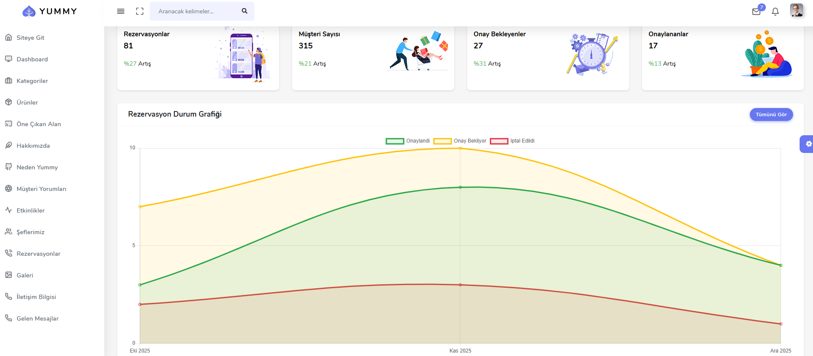
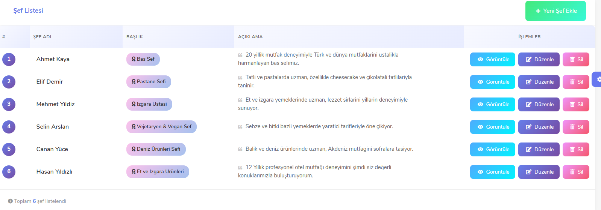
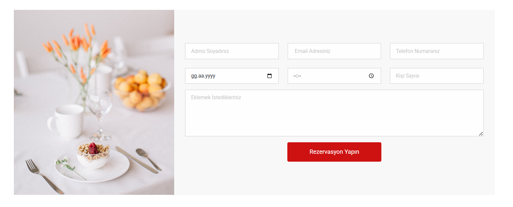
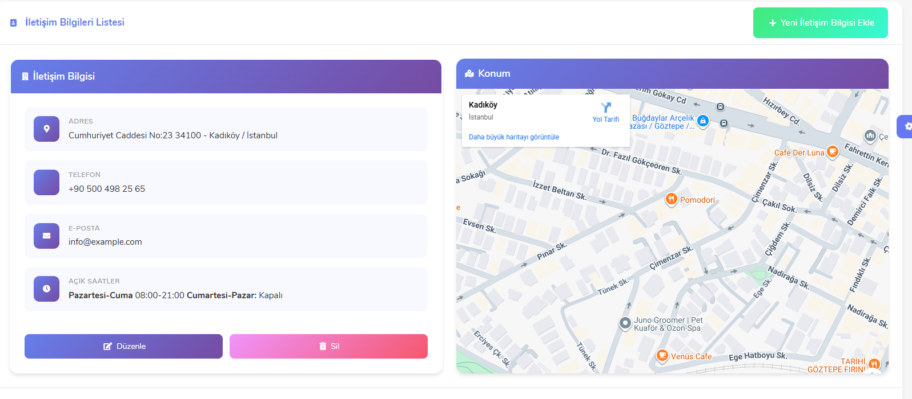

# 🚀 ApiProjeKampi - Restoran Yönetim Sistemi

Bu proje, **ASP.NET Core Web API** ve **ASP.NET Core MVC (WebUI)** kullanılarak geliştirilmiş çok katmanlı bir uygulamadır. Backend tarafında RESTful API mimarisi, frontend tarafında ise MVC yapısı kullanılmıştır.

---

## 📸 Proje Ekran Görüntüleri

### 📊 Yönetici Dashboard Paneli
Sistemdeki rezervasyon istatistikleri, müşteri sayıları ve onay durumları grafiklerle anlık olarak takip edilebilmektedir.

### 🍽 Ana Sayfa ve Menü Yapısı
Kullanıcıların restoran hakkında bilgi alabileceği ve rezervasyon yapabileceği modern arayüz.

### 👨‍🍳 Yönetim Paneli (Şef & Ürün Yönetimi)
| Ürün Listesi | Şef Yönetimi |
| :---: | :---: |
|  |  |

### 📅 Rezervasyon ve İletişim
| Rezervasyon Formu | İletişim ve Konum |
| :---: | :---: |
|  |  |

---

## 🍽 Proje Konusu
Proje; bir restoranın temel ihtiyaçlarını karşılayacak şekilde tasarlanmıştır.

- 📅 **Rezervasyon yönetimi**
- 👨‍🍳 **Şefler ve ekip tanıtımı**
- 📊 **Yönetici (Admin) Dashboard paneli**
- 🖼 **Restoran galeri alanı**

---

## 🔧 Kullanılan Teknolojiler
- **Backend:** ASP.NET Core Web API, Entity Framework Core, MSSQL, AutoMapper, FluentValidation.
- **Frontend:** ASP.NET Core MVC, Razor View, ViewComponents, Chart.js.
- **Mimari:** Çok Katmanlı Mimari (N-Tier Architecture), RESTful API.

---

## 🤖 AI Menü Durumu
Projede AI menüsü için altyapı hazırlanmıştır. Ancak **API anahtarı eklenmediği için** şu anda aktif değildir.

---

## 🚀 Kurulum
1. Projeyi klonlayın: `git clone https://github.com/SevilayOnogul/ApiProjeKampi.git`
2. `appsettings.json` dosyasında veritabanı bağlantısını güncelleyin.
3. Migration'ları uygulayın: `Update-Database`
4. Projeyi çalıştırın.
